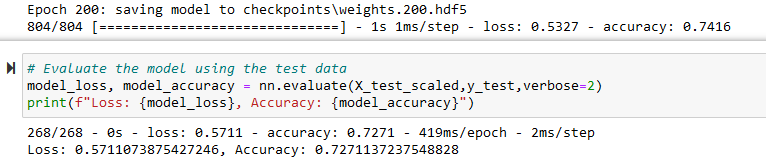

# Neural_Network_Charity_Analysis

## Overview
The purpose of this analysis is to use a deep learning model to find whether an applicant would be successful if it received funding from Alphabet Soup.

## Results

### Data Preprocessing
* The target for my model is the IS_SUCCESSFUL category - we want to know whether we have a success on our hands.
* The features for my model are APPLICATION_TYPE, AFFILIATION, CLASSIFICATION, USE_CASE, ORGANIZATION, STATUS, INCOME_AMT, SPECIAL_CONSIDERATIONS, and ASK_AMT.
* The variables removed from the input data are EIN and NAME.

### Compiling, Training, and Evaluating the Model
* Initially, I chose to have two hidden layers with 80 neurons in the first layer and 30 neurons in the second layer. Both had a ReLu activation function, with the output layer having a Sigmoid activation function. ReLu activation functions are good for looking at positive nonlinear data for classification, which suits this data. The Sigmoid activation function works for binary classification, which again suits the data - we only want to know whether it will be successful or not.
* I was not able to achieve the target model performance - hovering just around 72%, 75% was just barely unreachable to me.
* In order to increase model performance, I binned the INCOME_AMT variable, creating a new category for incomes above 5 million (as opposed to 5M-10M, 10M-50M, and 50M+), upped the neurons in the second layer to 40, added a third hidden layer with 20 neurons, and doubled the number of epochs to reach 200. This did not substantially change model performance, and possibly made the model more prone to overfitting.

### Inital Model Performance

### Optimized Model Performance

## Summary
Overall, the deep learning model is able to predict whether an applicant will thrive upon receiving funding from Alphabet Soup with ~70% accuracy. Considering this is a a large tabular dataset, I would recommend testing a random forest model out and seeing whether it would have more success in predicting success. It would require the same amount of data preprocessing, less code, less runtime, and should have at least around the same performance as the deep learning model.
